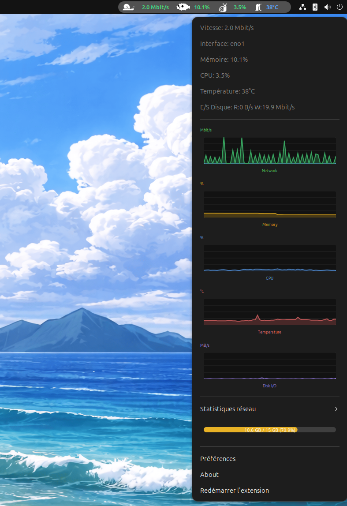
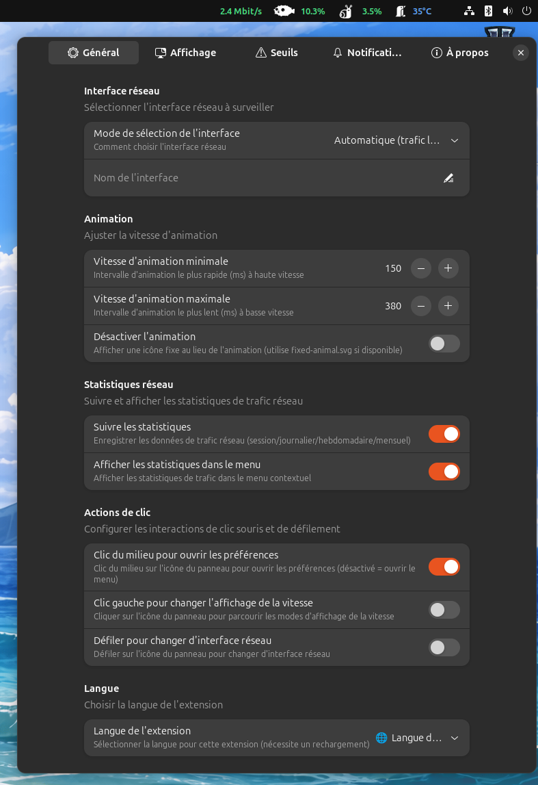
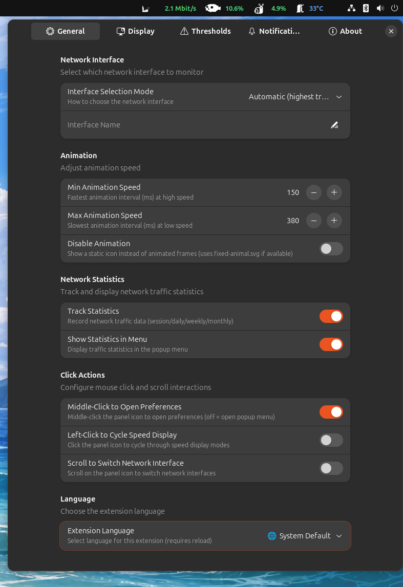
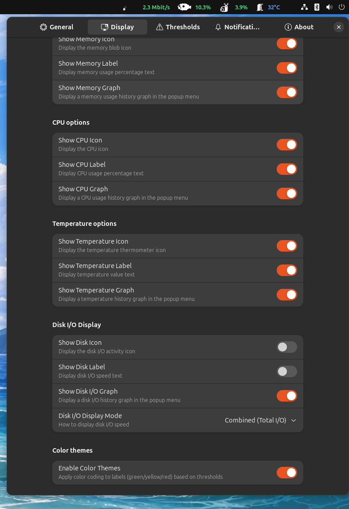
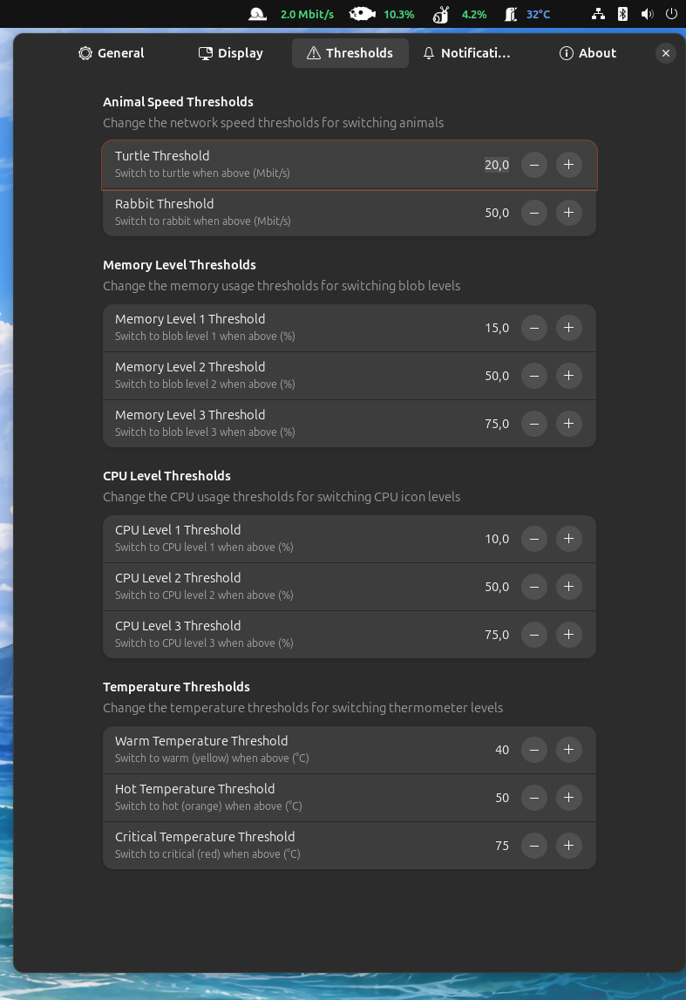
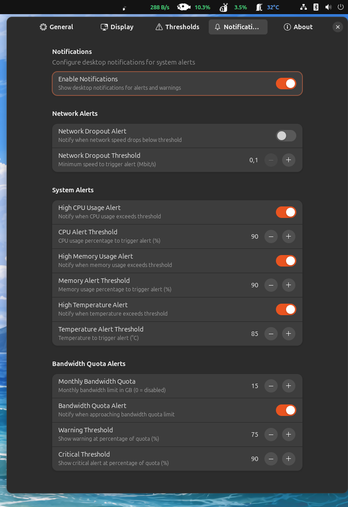

# Net Speed Animals -- GNOME Shell Extension

[](LICENSE)


A complete GNOME Shell system monitoring extension featuring animated
animals (snail 🐌, turtle 🐢, rabbit 🐰) that change according to
network speed, along with visual indicators for CPU, memory,
temperature, and disk activity.

------------------------------------------------------------------------

## Quick Installation

``` bash
chmod +x install.sh
./install.sh
```

------------------------------------------------------------------------

## 📖 Documentation

🇫🇷 Lire en français : [README FR](README.fr.md)  

-----------------------------------------------------------------------

## Features

### 🌐 Network

-   **Animated animal** based on network speed (snail → turtle → rabbit)
-   **Speed display** in Mbit/s, KB/s, or B/s (adaptive)
-   **Display modes**: combined, separate (↓/↑), download only, upload
    only
-   **Interface selection**: automatic or manual (eth0, wlan0, etc.)
-   **Real-time bandwidth graph** in the menu (60s history)

### 🧠 Memory

-   **4-level blob icon** based on memory usage
-   **% label** displayed in the panel
-   **Configurable thresholds** (25%, 50%, 75% by default)
-   **Memory graph** (yellow) in the menu

### ⚡ CPU

-   **4-level CPU activity icon**
-   **% label** displayed in the panel
-   **Configurable thresholds** (25%, 50%, 75% by default)
-   **CPU graph** (blue) in the menu

### 🌡️ Temperature

-   **4-level thermometer icon** (cold, warm, hot, critical)
-   **°C label** displayed in the panel
-   **Automatic thermal zone detection**
-   **Configurable thresholds** (50°C, 70°C, 85°C by default)
-   **Temperature graph** (red) in the menu

### 💾 Disk (I/O)

-   **4-level disk activity icon** (idle, low, medium, high)
-   **Speed label** in Mbit/s, KB/s, or B/s (adaptive)
-   **Display modes**: combined, separate (R:/W:), read only, write only
-   **Automatic device detection** (sda, nvme0n1, etc.)
-   **Disk I/O graph** (purple) in the menu

### 📊 Network Statistics

-   **Traffic tracking**: session, daily, weekly, monthly
-   **Automatic save** every 60 seconds
-   **Session stats reset**

### 📈 Bandwidth Quota

-   **Progress bar** in the menu (green → yellow → orange → red)
-   **Configurable monthly quota** in GB
-   **Notifications** at 75% (warning) and 90% (critical)

### 🔔 Notifications

-   **Network alert**: speed below threshold
-   **CPU alert**: usage \> 90% (configurable)
-   **Memory alert**: usage \> 90% (configurable)
-   **Temperature alert**: temperature \> 85°C (configurable)
-   **Quota alert**: warning and critical levels
-   **Anti-spam protection**: 5-minute delay between identical alerts

### 🎨 Color Themes

-   **Adaptive label colors** based on thresholds (green/yellow/red)
-   Applies to network speed, memory, CPU, and temperature

### 🖱️ Click Actions (disabled by default)

-   **Left click**: cycle through speed display modes
-   **Middle click**: open preferences
-   **Scroll**: change network interface

------------------------------------------------------------------------

## 📸 Screenshots

-   Menu\
    

-   General\
    \
    

-   Display\
    \
    

-   Thresholds\
    

-   Notifications\
    

-   About\
    

------------------------------------------------------------------------

## Configuration

Open preferences:

``` bash
gnome-extensions prefs net-speed-animals@spiderdev.fr
```

### Preferences Pages

#### General

-   Animal speed thresholds (turtle/rabbit)
-   Animation speed (min/max)
-   Memory and CPU thresholds (4 levels)
-   Temperature thresholds (warm/hot/critical)
-   Network speed display mode
-   Network interface selection
-   Color themes
-   Click actions (left click, scroll)
-   Statistics and graphs (speed, memory, CPU, temperature, disk)

#### Display

-   Enable/disable each icon and label
-   Individual graphs for each metric
-   Disk I/O display mode

#### Notifications

-   Global enable/disable
-   Network alerts with configurable threshold
-   CPU alerts with configurable threshold
-   Memory alerts with configurable threshold
-   Temperature alerts with configurable threshold
-   Monthly bandwidth quota with warning/critical thresholds

------------------------------------------------------------------------

## Project Structure

    net-speed-animals@spiderdev.fr/
    ├── extension.js           # Main extension code
    ├── prefs.js               # Preferences interface
    ├── metadata.json          # Extension metadata
    ├── stylesheet.css         # CSS styles
    ├── install.sh             # Installation script
    ├── icons/
    │   ├── snail/             # Snail animations (7 frames)
    │   ├── turtle/            # Turtle animations (7 frames)
    │   ├── rabbit/            # Rabbit animations (7 frames)
    │   ├── blob/              # Memory icons (4 levels)
    │   ├── cpu/               # CPU icons (4 levels)
    │   ├── temperature/       # Temperature icons (4 levels)
    │   └── disk/              # Disk icons (4 levels)
    ├── monitors/
    │   ├── temperatureMonitor.js  # Reads /sys/class/thermal/
    │   └── diskMonitor.js         # Reads /proc/diskstats
    ├── widgets/
    │   ├── speedGraph.js      # Network graph (download/upload)
    │   ├── systemGraph.js     # Generic graph (memory, CPU, temp)
    │   └── quotaBar.js        # Quota progress bar
    ├── utils/
    │   ├── storage.js         # Network stats storage
    │   ├── formatters.js      # Formatting (bytes, temperature)
    │   └── notifications.js   # Notification manager
    ├── schemas/
    │   └── org.gnome.shell.extensions.net-speed-animals.gschema.xml
    ├── po/
    │   └── fr.po              # French translation
    └── locale/
        └── fr/LC_MESSAGES/    # Compiled translation

------------------------------------------------------------------------

## Compatibility

-   GNOME Shell 45, 46, 47, 48\
-   Wayland and X11\
-   Ubuntu, Fedora, Arch Linux

------------------------------------------------------------------------

## Uninstall

``` bash
gnome-extensions uninstall net-speed-animals@spiderdev.fr
```
