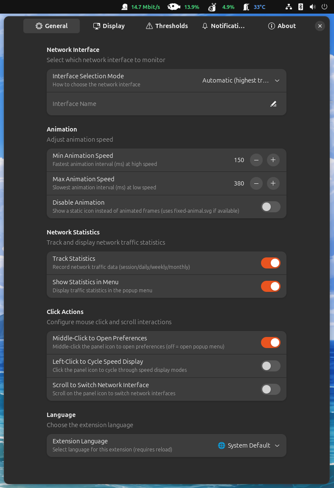
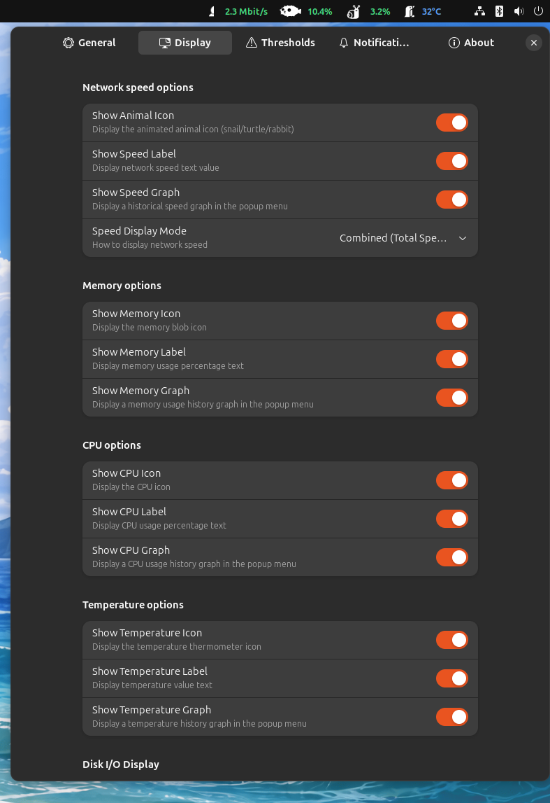

# 🐾 Net Speed Animals — Extension GNOME Shell

[](../LICENSE)


Une extension GNOME Shell **magnifique et complète** de surveillance système avec des **animaux animés** qui changent selon votre débit réseau, accompagnés d'indicateurs visuels élégants pour le CPU, la mémoire, la température et l'activité disque.

Transformez votre moniteur système ennuyeux en une expérience visuelle délicieuse et animée ! 🎨✨

------------------------------------------------------------------------

## ⚡ Installation rapide

``` bash
chmod +x install.sh
./install.sh
```

Puis redémarrez GNOME Shell :
- **X11** : `Alt+F2` → tapez `r` → `Entrée`
- **Wayland** : Déconnexion et reconnexion

------------------------------------------------------------------------

## 📖 Documentation

🇬🇧 **Read in English**: [README.md](../README.md)  

------------------------------------------------------------------------

## 🎭 Thèmes d'icônes

Choisissez parmi **5 magnifiques thèmes animés**, chacun avec 3 niveaux de vitesse :

| Thème | Vitesse lente | Vitesse moyenne | Vitesse rapide |
|-------|---------------|-----------------|----------------|
| 🌊 **Aquatique** | Poisson 🐟 | Dauphin 🐬 | Baleine 🐋 |
| 🐾 **Classique** | Escargot 🐌 | Tortue 🐢 | Lapin 🐇 |
| 🏡 **Domestique** | Chat 🐱 | Chien 🐕 | Cheval 🐎 |
| 🦅 **Oiseaux** | Canard 🦆 | Colibri 🐦 | Aigle 🦅 |
| 🐝 **Insectes** | Fourmi 🐜 | Coccinelle 🐞 | Abeille 🐝 |

Chaque animal dispose d'**animations fluides image par image** qui s'adaptent à votre débit réseau !

------------------------------------------------------------------------

## ✨ Fonctionnalités

### 🌐 Surveillance réseau

-   🎬 **Animaux animés** qui changent selon le débit réseau en temps réel
-   📊 **Affichage intelligent** en Mbit/s, KB/s ou B/s (auto-adaptatif)
-   🔄 **Plusieurs modes d'affichage** :
    - Combiné (trafic total)
    - Séparé (↓ téléchargement / ↑ envoi)
    - Téléchargement seul
    - Envoi seul
-   🔌 **Sélection d'interface** : automatique (trafic le plus élevé) ou manuelle (eth0, wlan0, enp3s0, etc.)
-   📈 **Graphique de bande passante** en temps réel dans le menu (historique de 60 secondes avec courbes téléchargement/envoi)
-   ⚙️ **Vitesse d'animation personnalisable** : ajuster les intervalles min/max (90-450ms)
-   🎯 **Seuils de vitesse configurables** pour contrôler quand les animaux changent

### 🧠 Surveillance mémoire

-   💧 **Icône blob à 4 niveaux** qui grandit avec l'utilisation mémoire
-   📍 **Étiquette pourcentage** affichée dans le panneau
-   🎚️ **Seuils configurables** (25%, 50%, 75% par défaut)
-   📊 **Graphique d'utilisation mémoire** (courbe jaune) dans le menu
-   🔔 **Alertes mémoire élevée** (seuil personnalisable, 90% par défaut)

### ⚡ Surveillance CPU

-   🔥 **Icône d'activité CPU à 4 niveaux**
-   📍 **Étiquette pourcentage** affichée dans le panneau
-   🎚️ **Seuils configurables** (25%, 50%, 75% par défaut)
-   📊 **Graphique d'utilisation CPU** (courbe bleue) dans le menu
-   🔔 **Alertes CPU élevé** (seuil personnalisable, 90% par défaut)

### 🌡️ Surveillance température

-   🌡️ **Icône thermomètre à 4 niveaux** (froid → tiède → chaud → critique)
-   📍 **Étiquette température** en °C affichée dans le panneau
-   🔍 **Détection automatique des zones thermiques** (x86_pkg_temp, acpitz, etc.)
-   🎚️ **Seuils configurables** (50°C, 70°C, 85°C par défaut)
-   📊 **Graphique température** (courbe rouge) dans le menu
-   🔔 **Alertes température élevée** (seuil personnalisable, 85°C par défaut)

### 💾 Surveillance E/S disque

-   💿 **Icône d'activité disque à 4 niveaux** (inactif → faible → moyen → élevé)
-   📍 **Étiquette vitesse** en MB/s, KB/s ou B/s (auto-adaptatif)
-   🔄 **Plusieurs modes d'affichage** :
    - Combiné (E/S total)
    - Séparé (R: lecture / W: écriture)
    - Lecture seule
    - Écriture seule
-   🔍 **Détection automatique des périphériques** (sda, sdb, nvme0n1, etc.)
-   🎚️ **Seuils d'activité configurables** (1, 10, 50 MB/s par défaut)
-   📊 **Graphique E/S disque** (courbe violette) dans le menu

### 📊 Suivi des statistiques réseau

-   📅 **Suivi multi-périodes** :
    - Session (depuis le démarrage de l'extension)
    - Journalier (dernières 24 heures)
    - Hebdomadaire (7 derniers jours)
    - Mensuel (30 derniers jours)
-   💾 **Sauvegarde automatique** toutes les 60 secondes en stockage persistant
-   🔄 **Option de réinitialisation** de session via le menu
-   📈 **Détail complet** du trafic téléchargement/envoi

### 📈 Gestion du quota de bande passante

-   🎯 **Barre de progression visuelle** dans le menu avec code couleur :
    - 🟢 Vert (0-50%) : Zone sûre
    - 🟡 Jaune (50-75%) : Usage modéré
    - 🟠 Orange (75-90%) : Zone d'avertissement
    - 🔴 Rouge (90-100%) : Zone critique
-   📊 **Quota mensuel** configurable en Go
-   🔔 **Notifications intelligentes** :
    - ⚠️ Avertissement à 75% (personnalisable)
    - 🚨 Critique à 90% (personnalisable)
-   📍 **Affichage de l'usage en direct** : "XX,X Go / YY Go (ZZ%)"

### 🔔 Système de notification intelligent

-   🌐 **Alertes perte de connexion** : notifie quand le débit tombe sous le seuil (1 Mbit/s par défaut)
-   ⚡ **Alertes surcharge CPU** : notifie quand l'utilisation CPU dépasse le seuil (90% par défaut)
-   🧠 **Alertes pression mémoire** : notifie quand l'utilisation mémoire dépasse le seuil (90% par défaut)
-   🌡️ **Alertes température** : notifie quand la température dépasse le seuil (85°C par défaut)
-   📊 **Alertes quota de bande passante** : notifications d'avertissement et de niveau critique
-   🛡️ **Protection anti-spam** : délai de 5 minutes entre les alertes identiques
-   ✅ **Entièrement personnalisable** : activer/désactiver les alertes individuelles et ajuster tous les seuils

### 🎨 Personnalisation visuelle

-   🌈 **Thèmes de couleur adaptatifs** : les étiquettes changent de couleur selon les seuils
    - 🟢 Vert : Plage normale/sûre
    - 🟡 Jaune : Plage d'avertissement
    - 🔴 Rouge : Plage critique
-   📏 **Ajustement taille des icônes** : 16-64px (défaut 32px)
-   📍 **Position dans le panneau** : boîte gauche, centre ou droite
-   🔢 **Index de position** : ajustement fin du placement dans la boîte choisie
-   🎭 **Sélection de thème** : 5 thèmes intégrés + mode personnalisé (choix manuel de 3 animaux)
-   ⏸️ **Basculement animation** : utiliser des icônes statiques si préféré

### 🩺 Diagnostic & Dépannage

-   🔎 **Page Diagnostic dédiée** dans les préférences
-   ♻️ **Bouton Refresh** pour relancer les vérifications instantanément
-   ✅ **Vérifications en direct** de `/proc/net/dev`, `/sys/class/thermal`, et `/proc/diskstats`
-   🌐 **Détection immédiate** de l'interface active, de la zone thermique et du disque actif

### 🖱️ Actions de clic interactives

-   👆 **Clic gauche** : parcourir les modes d'affichage de vitesse réseau *(optionnel)*
-   🖱️ **Clic milieu** : ouvrir les préférences ou le menu *(configurable)*
-   🔄 **Molette de défilement** : basculer entre les interfaces réseau *(optionnel)*

*Toutes les actions de clic sont désactivées par défaut pour une expérience épurée*

### 🌍 Internationalisation

-   🇬🇧 **English** (Anglais)
-   🇫🇷 **Français**
-   🇩🇪 **Deutsch** (Allemand)
-   🇪🇸 **Español** (Espagnol)
-   🇮🇹 **Italiano** (Italien)

Sélectionnez votre langue préférée dans les préférences ou utilisez celle du système

### 🎚️ Modes de seuils prédéfinis

Choisissez parmi les configurations de seuils prédéfinies :
-   **Stable** : Seuils équilibrés pour surveillance d'usage normal
-   **Spectacular** : Seuils plus sensibles pour retour visuel
-   **Stress** : Seuils extrêmes pour tests de stress

------------------------------------------------------------------------

## 📸 Captures d'écran

Découvrez l'interface magnifique :

### Indicateurs du panneau

*Animaux animés et métriques système en un coup d'œil*

### Menu déroulant

*Informations système complètes avec graphiques en direct*

### Fenêtre de préférences

#### 🔧 Paramètres généraux

*Interface réseau, vitesse d'animation, position panneau, statistiques et actions de clic*

#### 🎨 Options d'affichage

*Thème d'icônes, taille d'icônes et options de vitesse réseau*


*Options d'affichage mémoire, CPU, température et disque*

#### 🎚️ Configuration des seuils

*Ajustez la sensibilité pour réseau, mémoire, CPU, température et disque*

#### 🔔 Paramètres de notification

*Configurez les alertes pour le réseau, les ressources système et le quota de bande passante*

#### ℹ️ À propos

*Informations sur l'extension et liens de support*

------------------------------------------------------------------------

## ⚙️ Configuration

Ouvrir la fenêtre de préférences :

``` bash
gnome-extensions prefs net-speed-animals@spiderdev.fr
```

Ou **clic milieu** sur l'icône du panneau (si activé dans les paramètres)

### 📋 Aperçu des pages de préférences

La fenêtre de préférences inclut une recherche intégrée et suit cet ordre :
-   Général → Affichage → Seuils → Notifications → Diagnostic → À propos

#### 🔧 Général
-   **Profils rapides**
    -   Presets en un clic : Custom, Laptop, Gaming, Dev, Low-power
    -   Action de remise à Custom
-   **Interface réseau**
    -   Mode de sélection : Automatique (trafic le plus élevé) ou Manuel
    -   Saisie du nom d'interface pour sélection manuelle
-   **Position dans le panneau**
    -   Choisir la boîte : gauche, centre ou droite
    -   Index de position dans la boîte (0 = première position)
-   **Actions de clic**
    -   Basculer clic gauche (parcours)
    -   Basculer clic milieu (préférences)
    -   Basculer défilement (changement d'interface)
-   **Contrôle d'animation**
    -   Vitesse minimale d'animation (50-500ms)
    -   Vitesse maximale d'animation (100-1000ms)
    -   Option de désactivation de l'animation (utiliser icônes statiques)
-   **Statistiques réseau**
    -   Activer/désactiver le suivi
    -   Afficher les statistiques dans le menu
-   **Langue**
    -   Système par défaut ou spécifique (🇬🇧 🇫🇷 🇩🇪 🇪🇸 🇮🇹)
    -   Nécessite rechargement de l'extension
-   **Sauvegarde & restauration**
    -   Export des paramètres en JSON
    -   Import des paramètres depuis JSON
-   **Réinitialisation**
    -   Remettre tous les paramètres de l'extension par défaut

#### 🎨 Affichage
-   **Sélection du thème d'icônes**
    -   5 thèmes intégrés : Aquatique, Classique, Domestique, Oiseaux, Insectes
    -   Mode personnalisé : choisir manuellement les animaux lent/moyen/rapide
-   **Taille des icônes**
    -   Ajustable de 16 à 64 pixels (défaut : 32px)
    -   S'applique à toutes les icônes du panneau
-   **Thèmes de couleur**
    -   Activer/désactiver les couleurs adaptatives des étiquettes (vert/jaune/rouge)
-   **Options de vitesse réseau**
    -   Afficher/masquer l'icône animée de l'animal
    -   Afficher/masquer l'étiquette de texte de vitesse
    -   Afficher/masquer le graphique de vitesse dans le menu
    -   Mode d'affichage : combiné, séparé, téléchargement seul, envoi seul
-   **Options CPU**
    -   Afficher/masquer l'icône CPU
    -   Afficher/masquer l'étiquette de pourcentage CPU
    -   Afficher/masquer le graphique CPU dans le menu
-   **Options mémoire**
    -   Afficher/masquer l'icône blob de mémoire
    -   Afficher/masquer l'étiquette de pourcentage mémoire
    -   Afficher/masquer le graphique mémoire dans le menu
-   **Options température**
    -   Afficher/masquer l'icône thermomètre
    -   Afficher/masquer l'étiquette température
    -   Afficher/masquer le graphique température dans le menu
-   **Options E/S disque**
    -   Afficher/masquer l'icône d'activité disque
    -   Afficher/masquer l'étiquette de vitesse disque
    -   Afficher/masquer le graphique E/S disque dans le menu
    -   Mode d'affichage : combiné, séparé, lecture seule, écriture seule

#### 🎚️ Seuils
-   **Mode de seuils**
    -   Prédéfini : Stable, Spectacular ou Stress
    -   Appliquer des paramètres cohérents sur tous les moniteurs
-   **Seuils de vitesse réseau**
    -   Seuil tortue (Mbit/s) - défaut : 2,0
    -   Seuil lapin (Mbit/s) - défaut : 20,0
-   **Seuils de niveau mémoire** (%)
    -   Niveau 1 (usage faible) - défaut : 25%
    -   Niveau 2 (usage moyen) - défaut : 50%
    -   Niveau 3 (usage élevé) - défaut : 75%
-   **Seuils de niveau CPU** (%)
    -   Niveau 1 - défaut : 25%
    -   Niveau 2 - défaut : 50%
    -   Niveau 3 - défaut : 75%
-   **Seuils de température** (°C)
    -   Tiède (jaune) - défaut : 50°C
    -   Chaud (orange) - défaut : 70°C
    -   Critique (rouge) - défaut : 85°C
-   **Seuils E/S disque** (MB/s)
    -   Niveau 1 (activité faible) - défaut : 1,0
    -   Niveau 2 (activité moyenne) - défaut : 10,0
    -   Niveau 3 (activité élevée) - défaut : 50,0

#### 🔔 Notifications
-   **Contrôle global**
    -   Interrupteur principal activer/désactiver
-   **Alertes réseau**
    -   Activer notification de perte de connexion
    -   Seuil de déconnexion (Mbit/s) - défaut : 1,0
-   **Alertes système**
    -   Alerte utilisation CPU élevée + seuil (%) - défaut : 90%
    -   Alerte utilisation mémoire élevée + seuil (%) - défaut : 90%
    -   Alerte température élevée + seuil (°C) - défaut : 85°C
-   **Quota de bande passante**
    -   Quota mensuel en Go (0 = désactivé)
    -   Activer les notifications de quota
    -   Seuil d'avertissement (%) - défaut : 75%
    -   Seuil critique (%) - défaut : 90%

#### 🩺 Diagnostic
-   **Refresh Diagnostics**
    -   Relancer les vérifications système à la demande
-   **Détection en direct**
    -   Interface réseau active
    -   Zone thermique active
    -   Disque actif
-   **État des permissions**
    -   Vérification de lecture de `/proc/net/dev`, `/sys/class/thermal`, `/proc/diskstats`

#### ℹ️ À propos
-   Version, liens du projet et liens de support

------------------------------------------------------------------------

## 🏗️ Structure du projet

Explorez la base de code bien organisée :

```
net-speed-animals@spiderdev.fr/
├── src/
│   ├── extension.js           # Point d'entrée principal
│   ├── prefs.js               # Interface préférences (Adwaita)
│   ├── metadata.json          # Métadonnées de l'extension
│   ├── stylesheet.css         # Style du panneau
│   ├── prefs.css              # Style des préférences
│   │
│   ├── monitors/              # Collecteurs de métriques système
│   │   ├── networkMonitor.js  # Analyseur /proc/net/dev
│   │   ├── cpuMonitor.js      # Analyseur /proc/stat
│   │   ├── memoryMonitor.js   # Analyseur /proc/meminfo
│   │   ├── temperatureMonitor.js  # Lecteur /sys/class/thermal/
│   │   └── diskMonitor.js     # Analyseur /proc/diskstats
│   │
│   ├── ui/                    # Composants d'interface utilisateur
│   │   ├── panelIndicator.js  # Icônes et étiquettes de la barre
│   │   ├── menuBuilder.js     # Constructeur de menu déroulant
│   │   ├── iconLoader.js      # Chargeur d'icônes SVG
│   │   ├── animationController.js  # Gestionnaire d'animation
│   │   └── renderEngine.js    # Moteur de rendu du panneau
│   │
│   ├── widgets/               # Widgets UI personnalisés
│   │   ├── speedGraph.js      # Graphique vitesse réseau (2 courbes)
│   │   ├── systemGraph.js     # Widget graphique système générique
│   │   └── quotaBar.js        # Barre de progression quota bande passante
│   │
│   ├── utils/                 # Modules utilitaires
│   │   ├── constants.js       # Constantes de configuration
│   │   ├── formatters.js      # Assistants de formatage de données
│   │   ├── notifications.js   # Gestionnaire de notifications
│   │   └── storage.js         # Persistance des statistiques
│   │
│   ├── icons/                 # Ressources d'icônes
│   │   └── themes/            # Dossiers de thèmes
│   │       ├── aquatic/       # Poisson → Dauphin → Baleine
│   │       ├── classic/       # Escargot → Tortue → Lapin
│   │       ├── domestic/      # Chat → Chien → Cheval
│   │       ├── birds/         # Canard → Colibri → Aigle
│   │       └── insects/       # Fourmi → Coccinelle → Abeille
│   │           ├── network/   # Animaux vitesse réseau
│   │           ├── cpu/       # Icônes activité CPU (4 niveaux)
│   │           ├── memory/    # Icônes blob mémoire (4 niveaux)
│   │           ├── temperature/ # Icônes thermomètre (4 niveaux)
│   │           └── disk/      # Icônes activité disque (4 niveaux)
│   │
│   ├── schemas/               # Schéma GSettings
│   │   ├── gschemas.compiled
│   │   └── org.gnome.shell.extensions.net-speed-animals.gschema.xml
│   │
│   └── locale/                # Traductions
│       ├── de/LC_MESSAGES/    # Allemand
│       ├── en/LC_MESSAGES/    # Anglais
│       ├── es/LC_MESSAGES/    # Espagnol
│       ├── fr/LC_MESSAGES/    # Français
│       └── it/LC_MESSAGES/    # Italien
│
├── docs/                      # Documentation
│   ├── README.fr.md           # Documentation française
│   ├── CHANGELOG_IMPROVEMENTS.md
│   ├── CONSTANTS.md           # Documentation des constantes
│   ├── TESTING.md             # Guide de test
│   └── TRANSLATIONS.md        # Guide de traduction
│
├── po/                        # Sources de traduction
│   ├── *.po                   # Fichiers de traduction
│   └── POTFILES.in            # Fichiers à traduire
│
├── tools/                     # Outils de développement
│   └── translate.sh           # Générateur de traductions
│
├── install.sh                 # Script d'installation
└── uninstall.sh               # Script de désinstallation
```

------------------------------------------------------------------------

## 🔧 Détails techniques

### Configuration requise
-   **GNOME Shell** : 45, 46, 47
-   **Serveur d'affichage** : Wayland ou X11
-   **Distributions** : Ubuntu 23.10+, Fedora 39+, Arch Linux, etc.

### Sources de données
-   **Réseau** : `/proc/net/dev` - octets transmis/reçus par interface
-   **CPU** : `/proc/stat` - statistiques de temps CPU
-   **Mémoire** : `/proc/meminfo` - détails d'utilisation mémoire
-   **Température** : `/sys/class/thermal/thermal_zone*/temp` - capteurs thermiques
-   **Disque** : `/proc/diskstats` - statistiques E/S disque

### Performance
-   **Intervalle de mesure** : 1000ms (1 seconde)
-   **Intervalle d'animation** : 90-450ms (configurable)
-   **Points de données graphique** : 60 points (historique d'1 minute)
-   **Sauvegarde auto statistiques** : Toutes les 60 secondes
-   **Empreinte mémoire** : Minimale (~5-10 Mo)
-   **Surcharge CPU** : Négligeable (<1% sur systèmes modernes)

------------------------------------------------------------------------

## 🧪 Tests

L'extension inclut des tests unitaires complets couvrant tous les analyseurs système. Voir [docs/TESTING.md](TESTING.md) pour les détails.

```bash
cd src
gjs tests.js
```

**Couverture des tests** : 16 tests unitaires sur 5 suites de tests
-   NetworkMonitorTests (4 tests)
-   CpuMonitorTests (3 tests)
-   MemoryMonitorTests (3 tests)
-   DiskMonitorTests (3 tests)
-   TemperatureMonitorTests (3 tests)

------------------------------------------------------------------------

## 🌍 Contribuer

### Traductions
Nous accueillons les traductions ! Voir [docs/TRANSLATIONS.md](TRANSLATIONS.md) pour le guide de traduction.

Actuellement supporté :
-   🇬🇧 Anglais (100%)
-   🇫🇷 Français (100%)
-   🇩🇪 Allemand (100%)
-   🇪🇸 Espagnol (100%)
-   🇮🇹 Italien (100%)

### Rapports de bogues et demandes de fonctionnalités
Veuillez ouvrir une issue sur GitHub avec :
-   Version de GNOME Shell
-   Distribution et version
-   Description détaillée
-   Étapes pour reproduire (pour les bogues)

------------------------------------------------------------------------

## 📝 Licence

Licence MIT - Voir le fichier [LICENSE](../LICENSE)

------------------------------------------------------------------------

## 👨‍💻 Auteur

**Spiderdev**
-   🌐 Site web : [spiderdev.fr](https://spiderdev.fr)
-   💻 GitHub : [github.com/spiderdev-github/net-speed-animals](https://github.com/spiderdev-github/net-speed-animals)

------------------------------------------------------------------------

## 💖 Soutien

Si vous trouvez cette extension utile, envisagez de soutenir son développement :

-   ⭐ **Mettre une étoile au projet** sur GitHub
-   ☕ **Offrir un café** : [Buy Me a Coffee](https://www.buymeacoffee.com/spiderdev)
-   💸 **PayPal** : [PayPal](https://paypal.me/spiderdev)
-   🐛 **Signaler des bogues** pour aider à améliorer l'extension
-   🌍 **Contribuer des traductions** dans votre langue

------------------------------------------------------------------------

## 🗑️ Désinstallation

```bash
chmod +x uninstall.sh
./uninstall.sh
```

Ou manuellement :
```bash
gnome-extensions uninstall net-speed-animals@spiderdev.fr
```

------------------------------------------------------------------------

## 📚 Documentation supplémentaire

-   [🇬🇧 English README](../README.md)
-   [📋 Changelog & Améliorations](CHANGELOG_IMPROVEMENTS.md)
-   [📊 Documentation des constantes](CONSTANTS.md)
-   [🧪 Guide de test](TESTING.md)
-   [🌍 Guide de traduction](TRANSLATIONS.md)

------------------------------------------------------------------------

**Fait avec ❤️ pour la communauté GNOME**

*Transformez votre surveillance système en une expérience visuelle agréable !* 🐾✨
